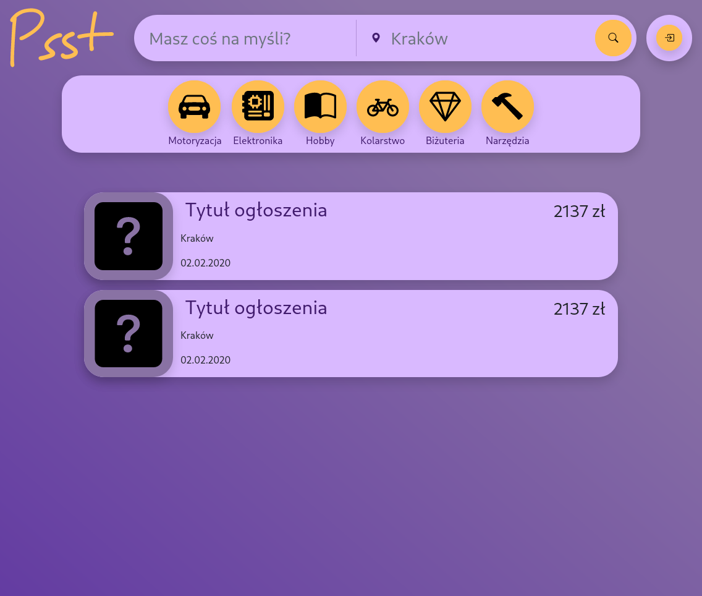
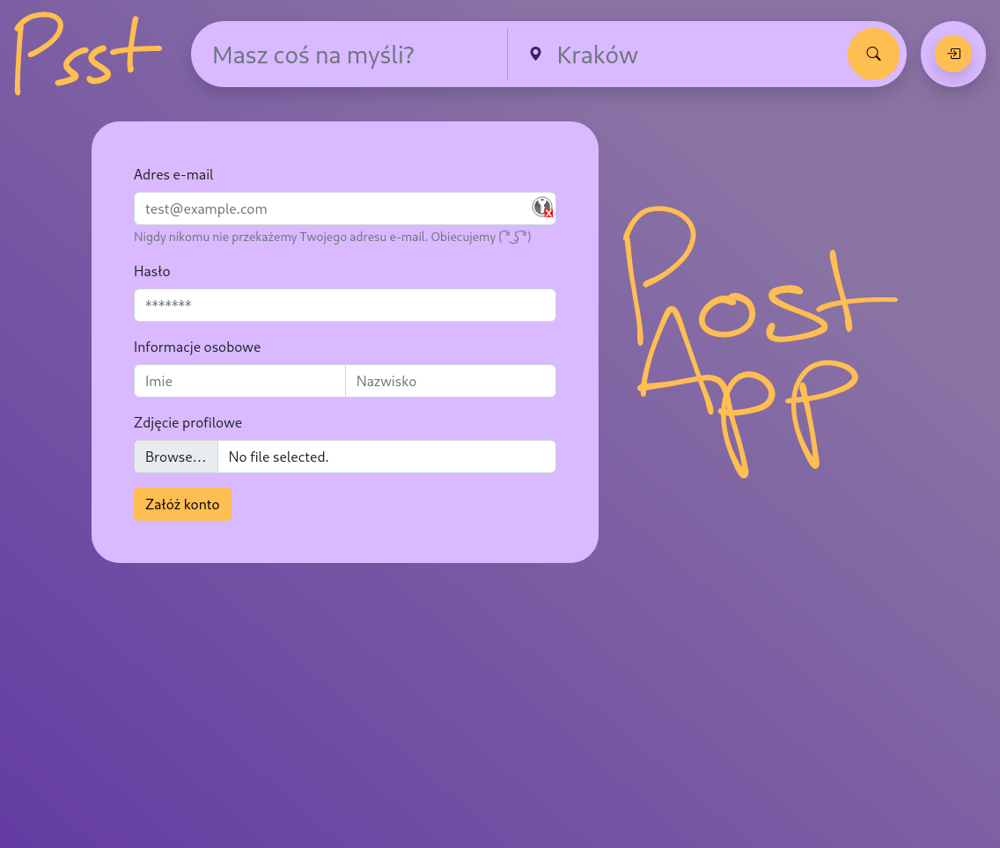
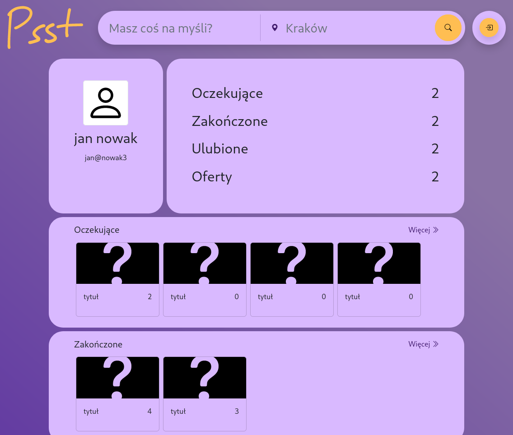
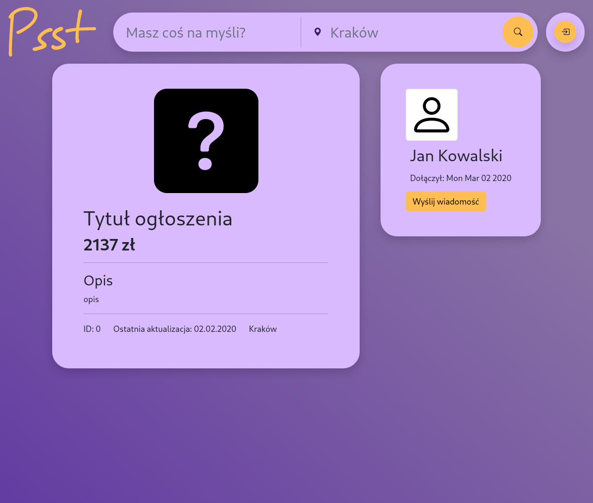

# PostApp

technologie:

 

  
  
 

 

 
 
 

Aplikacja umożliwia dodawanie i przeglądanie ogłoszeń, komunikację sprzedawcy i klienta.

Istnieją 3 typy użytkowników:
 - [ ] administrator - zarządza całym systemem lub jego częścią
 - [ ] użytkownik - przeszukuje ogłoszenia, komunikuje się z sprzedawcą, tworzy i aktualizuje oferty, 

Użytkownik:
 - [x] zakładanie konta
 - możliwość wyszukiwania ofert/ogłoszeń po:
    * [ ] lokalizacji
    * [ ] parametrach
    * [ ] tytule
 - [ ] możliwość komunikacji z autorem oferty
 - [ ] tworzy oferty/ogłoszenia
 - [ ] zarządza ofertami/ogłoszenia
 - [ ] możliwość komunikacji z klientem

Aplikacja ma funkcje:
 - [ ] wyszukiwarka ofert/ogłoszeń
 - [ ] zarządzanie zleceniami utworzonymi przez Użytkownika
    * [ ] sprawdzanie statusu 
    * [ ] dodatkowe informacje
 - [ ] zarządzanie zleconymi zadaniami Sprzedawcom
    * [ ] aktualizacja statusu oferty
    * [ ] ustawianie ceny

przykłady użycia:
 - użytkownik:
  * wchodzi na widok wyszukiwarki
  * ustawia kategorię ogłoszeń
  * wpisuje frazę do wyszukiwarki
  * przegląda ogłoszenia
  * otwiera wybrane ogłoszenie
  * przegląda zdjęcia, opis
  * jeśli ogłoszenie go zainteresuje, rozpoczyna chat ze sprzedawcą
     - w tym momęcie tworzone jest nowe zamówienie/ticket, status oczekujące
  * sprzedawca i użytkownik uzgadniają detale
     - status zamówienia jest ustawiany na `w trakcie`
     - status zamówienia może zostać zmieniony na `odrzucone`
  * komunikuje się ze sprzedawcą w celu sfinalizowania zamówienia
     - status zamówienia może zostać ustawiony na `zakończone`

## Baza danych

## Widoki:

